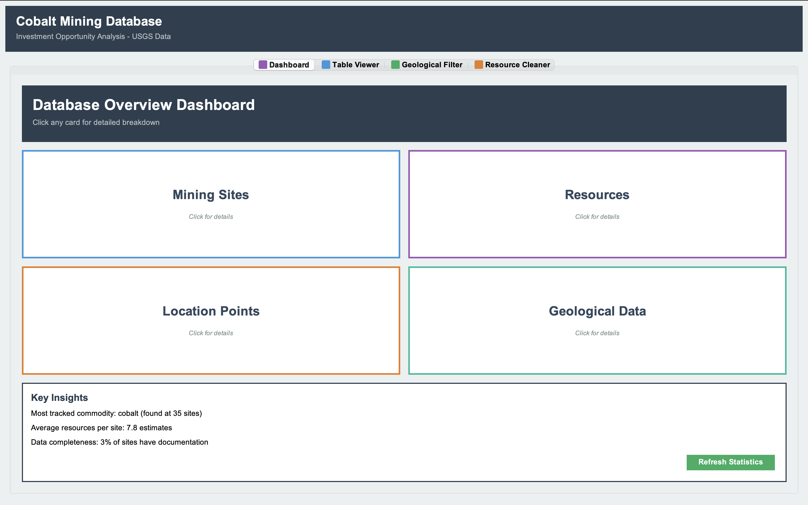
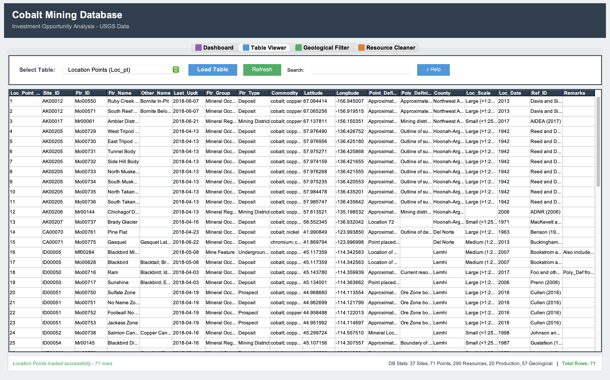
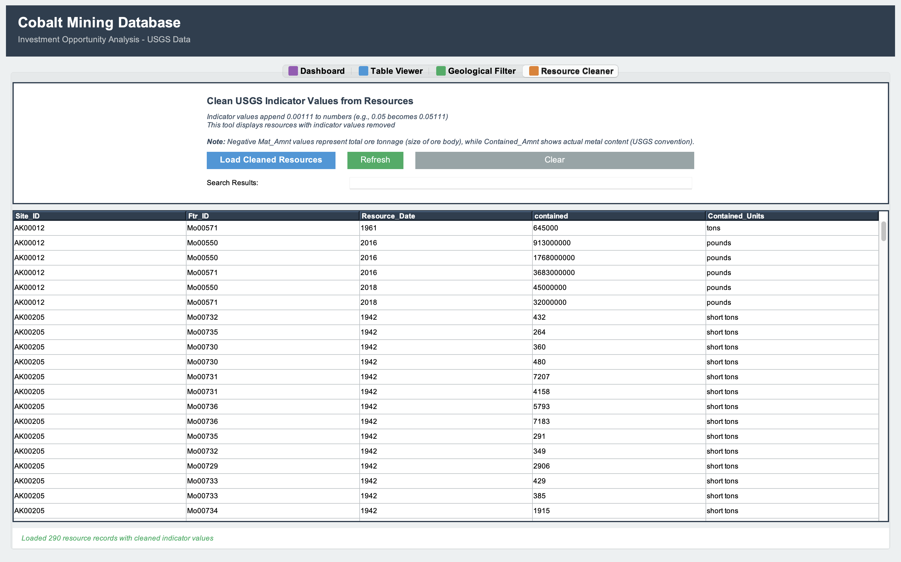

# Cobalt Mining Investment Analysis Database

A normalized relational database system for analyzing cobalt mining investment opportunities across the United States, built from USGS geological survey data.



## 🎯 Project Overview

This project transforms 11 CSV files from the USGS Cobalt Mining Database into a normalized 25-table relational database with a Java Swing GUI for investment opportunity analysis. The system enables filtering geological occurrences, analyzing resource estimates, and tracking production records across 37 mining sites.

**Key Features:**
- ✅ Normalized database design (3NF) reducing data redundancy across 25 tables
- ✅ Custom MySQL stored procedures for automated data cleaning and geological filtering
- ✅ Interactive Java Swing GUI with 4 analysis modules
- ✅ Color-coded resource visualizations for investment potential assessment
- ✅ Real-time dashboard analytics with sortable, searchable data tables
- ✅ Complex SQL joins reconstructing original USGS data structure

## 📊 Database Statistics

- **37** mining sites across multiple U.S. states
- **117** geological references
- **71** location points mapped
- **290** resource estimates analyzed
- **20** production records tracked
- **25** normalized database tables

## 📚 Data Source

**United States Geological Survey (USGS) Cobalt Mining Database**

**Citation:** Burger, M.H., Schmeda, G., Long, K.R., Reyes, T.A., and Karl. N.A., 2018, Cobalt Deposits in the United States: U.S. Geological Survey data release, https://doi.org/10.5066/P9V74HIU

## 🛠️ Technologies Used

- **Database:** MySQL 8.0
- **Language:** Java 17+
- **GUI Framework:** Java Swing & AWT
- **Database Connectivity:** JDBC (MySQL Connector/J 8.0)
- **IDE:** Eclipse (or any Java IDE)

## 📸 Screenshots

| Dashboard | Table Viewer |
|-----------|--------------|
|  |  |

| Geological Filter | Resource Cleaner |
|-------------------|------------------|
|  |  |

## 🚀 Installation & Setup

### Prerequisites

Before you begin, ensure you have:
- ✅ **Java JDK 17 or higher** - [Download here](https://www.oracle.com/java/technologies/downloads/)
- ✅ **MySQL Server 8.0+** - [Download here](https://dev.mysql.com/downloads/mysql/)
- ✅ **MySQL Workbench** (recommended) - [Download here](https://dev.mysql.com/downloads/workbench/)
- ✅ **Eclipse IDE** - [Download here](https://www.eclipse.org/downloads/) (or IntelliJ/VS Code)
- ✅ **MySQL Connector/J 8.0** - [Download here](https://dev.mysql.com/downloads/connector/j/)

---

### Step 1: Clone the Repository
```bash
git clone https://github.com/yourusername/cobalt-mining-investment-analysis.git
cd cobalt-mining-investment-analysis
```

---

### Step 2: Set Up the Database

#### Option A: Using MySQL Workbench (Recommended)

1. **Open MySQL Workbench** and connect to your local MySQL server

2. **Execute the SQL scripts in this order:**

   **First - Create the schema:**
   - File → Open SQL Script
   - Navigate to `database/schema/CreateTables.sql`
   - Click Execute (⚡ icon)

   **Second - Load all data:**
   - File → Open SQL Script
   - Navigate to `database/data/CobaltMining_CompleteDB.sql`
   - Click Execute (⚡ icon)
   - ⚠️ **This may take 1-2 minutes** - it's loading 290+ records across 25 tables

   **Third - Add stored procedures:**
   - File → Open SQL Script
   - Navigate to `database/procedures/StoredProcedures.sql`
   - Click Execute (⚡ icon)

#### Option B: Using MySQL Command Line
```bash
# Login to MySQL
mysql -u root -p

# Run the scripts
source /path/to/database/schema/CreateTables.sql;
source /path/to/database/data/CobaltMining_CompleteDB.sql;
source /path/to/database/procedures/StoredProcedures.sql;
```

#### Verify Database Installation

Run these commands in MySQL to confirm everything loaded correctly:
```sql
USE cobalt_mining;

-- Check tables were created
SHOW TABLES;
-- Should show 25 tables

-- Verify data loaded
SELECT COUNT(*) FROM SITE;              -- Should return 37
SELECT COUNT(*) FROM REFERENCE;         -- Should return 117
SELECT COUNT(*) FROM LOCATION_POINT;    -- Should return 71
SELECT COUNT(*) FROM RESOURCE;          -- Should return 290
SELECT COUNT(*) FROM PRODUCTION;        -- Should return 20

-- Check stored procedures
SHOW PROCEDURE STATUS WHERE Db = 'cobalt_mining';
-- Should show: filter_geol_by_commodity_type and clean_resource_indicators
```

✅ **If all counts match, your database is ready!**

---

### Step 3: Set Up the Java Application

#### Import Project into Eclipse

1. **Open Eclipse**

2. **Import the project:**
   - File → Import
   - General → Existing Projects into Workspace
   - Click Next
   - Browse to your cloned `cobalt-mining-database` folder
   - Click Finish

3. **Eclipse will automatically compile all Java files** (creates `bin/` folder)

#### Add MySQL Connector to Build Path

⚠️ **CRITICAL STEP** - The app won't run without this!

1. **Download MySQL Connector/J** if you haven't already:
   - Go to: https://dev.mysql.com/downloads/connector/j/
   - Select "Platform Independent"
   - Download the ZIP file
   - Extract it somewhere on your computer

2. **Add to Eclipse project:**
   - Right-click your project in Eclipse → Build Path → Configure Build Path
   - Click "Libraries" tab → Add External JARs
   - Navigate to extracted folder → select `mysql-connector-j-8.0.XX.jar`
   - Click Apply and Close

#### Configure Database Credentials

1. **Open** `src/database/DatabaseConnection.java`

2. **Update line 12** with your MySQL password:
```java
   private static final String DB_PASSWORD = "your_mysql_password_here";
```

3. **Optional:** If you're using a different username or port, update these too:
```java
   private static final String DB_URL = "jdbc:mysql://localhost:3306/cobalt_mining";
   private static final String DB_USER = "root";
```

4. **Save the file** (Ctrl+S / Cmd+S)

---

### Step 4: Run the Application

1. **In Eclipse, navigate to:** `src/gui/CobaltMiningGUI.java`

2. **Right-click the file** → Run As → Java Application

3. **The GUI should launch!** 🎉

---

## 🎮 How to Use the Application

### 📊 Dashboard Tab

The main analytics hub showing key statistics:

**Features:**
- **4 Statistics Cards:**
  - Total Sites Tracked
  - Total Resources Recorded
  - Total References Catalogued
  - Total Location Points Mapped
  - Each card has a "More Information" button for detailed breakdowns

- **Key Insights Panel:**
  - Most tracked commodity across all sites
  - Average resources per site
  - Data completeness percentage

- **Refresh Button:**
  - Reloads all statistics from database
  - Use after making database changes
  - Shows confirmation popup

---

### 📋 Table Viewer Tab

Explore the five main data views reconstructed from the normalized database:

**Available Tables:**
1. **Location Points** - Geographic coordinates and site identifiers
2. **Geological Occurrences** - Deposit types, commodities, features
3. **Location Polygons** - Boundary coordinates for mining areas
4. **Production Records** - Historical production data
5. **Resource Estimates** - Contained amounts, grades, tonnage

**How to Use:**
1. Select a table from the dropdown
2. Click "Load Table" button
3. Data appears in sortable, scrollable table

**Table Features:**
- ✅ **Sortable Columns** - Click any header to sort (ascending/descending)
- ✅ **Search Bar** - Type to filter across ALL columns in real-time
- ✅ **Color Coding** (Resource Estimates table only):
  - 🟢 **Dark Green:** High investment potential (>100,000)
  - 🟢 **Light Green:** High values (>10,000)
  - 🟡 **Light Yellow:** Medium values (>1,000)
  - ⚪ **White:** Low values or missing data (<1,000)
- ✅ **Row Counter** - Shows total records at bottom

**ℹ️ Help Button:**
- Explains sorting rules
- Details color coding system
- Clarifies why negative values appear in Mat_Amnt column

---

### 🔍 Geological Filter Tab

Filter geological occurrences using custom parameters:

**Filter Options:**
- **Commodity Type:** cobalt, copper, nickel, gold, silver, zinc, lead
- **Feature Type:** Deposit, Prospect, Occurrence, Mine, Mining District

**How to Use:**
1. Select commodity from first dropdown
2. Select feature type from second dropdown
3. Click "Apply Filter"
4. Results populate with status message

**Behind the Scenes:**
- Calls stored procedure: `filter_geol_by_commodity_type(commodity, feature)`
- Queries across multiple normalized tables
- Returns matching geological occurrences

**Additional Features:**
- Search bar works on filtered results
- Clear Results button resets the table
- Refresh button re-runs the last filter

---

### 🧹 Resource Cleaner Tab

Execute data cleaning operations on resource estimates:

**What It Does:**
- Runs stored procedure: `clean_resource_indicators()`
- Standardizes resource indicator values
- Cleans contained amounts and units
- Validates data consistency

**How to Use:**
1. Click "Load Cleaned Resources"
2. View cleaned dataset in table
3. Data is fully sortable and searchable

**Use Cases:**
- Data quality validation
- Before running investment analysis
- After importing new USGS data

---

## 🗄️ Database Schema Overview

The database is normalized to Third Normal Form (3NF) across 25 tables:

**Core Tables:**
- `SITE` - Primary site information
- `LOCATION_POINT` - Geographic coordinates
- `LOCATION_POLYGON` - Boundary polygons
- `GEOLOGICAL_OCCURRENCE` - Deposit classifications
- `RESOURCE` - Resource estimates and grades
- `PRODUCTION` - Historical production data
- `REFERENCE` - Citations and sources

**Lookup/Reference Tables:**
- Commodity types, feature types, units
- Resource indicators, contained amount types
- Geographic regions, site statuses

**Why 25 Tables?**
- Eliminates data redundancy from original 11 CSV files
- Ensures data integrity through foreign key constraints
- Optimizes query performance
- Enables flexible reporting and analysis

For complete schema documentation, see [docs/PROJECT_DOCUMENTATION.md](docs/CobaltMiningDB_Documentation.pdf)

---

## 🔧 Stored Procedures

### 1. `filter_geol_by_commodity_type(commodity, feature_type)`

Filters geological occurrences by commodity and feature classification.

**Parameters:**
- `commodity` - VARCHAR(50): e.g., 'cobalt', 'copper', 'nickel'
- `feature_type` - VARCHAR(50): e.g., 'Deposit', 'Prospect', 'Mine'

**Example:**
```sql
CALL filter_geol_by_commodity_type('cobalt', 'Deposit');
```

**Returns:** All geological occurrences matching both criteria

---

### 2. `clean_resource_indicators()`

Automated data cleaning for resource estimate records.

**What It Cleans:**
- Standardizes resource indicator values
- Validates contained amounts
- Normalizes unit measurements
- Removes inconsistencies

**Example:**
```sql
CALL clean_resource_indicators();
```

**Returns:** All cleaned resource records

---

## 📖 Additional Documentation

For complete technical documentation including:
- Detailed installation verification steps
- Database import process details
- Full feature descriptions
- Troubleshooting guide

See: [docs/PROJECT_DOCUMENTATION.md](docs/PROJECT_DOCUMENTATION.md)

---

## 🐛 Troubleshooting

### Database Connection Errors

**Error:** `Communications link failure` or `Access denied`

**Solutions:**
1. Verify MySQL is running:
```bash
   # Windows
   services.msc → Look for MySQL80
   
   # Mac
   System Preferences → MySQL → Check status
```

2. Check your password in `DatabaseConnection.java`

3. Verify database exists:
```sql
   SHOW DATABASES;
   -- Should see 'cobalt_mining'
```

---

### MySQL Connector Not Found

**Error:** `ClassNotFoundException: com.mysql.cj.jdbc.Driver`

**Solution:**
- You forgot to add MySQL Connector/J to build path
- See Step 3 above: "Add MySQL Connector to Build Path"

---

### Tables Not Loading in GUI

**Error:** Empty tables or "No data found"

**Solutions:**
1. Verify data loaded correctly:
```sql
   USE cobalt_mining;
   SELECT COUNT(*) FROM SITE;  -- Should be 37
```

2. Check database connection credentials

3. Look at Eclipse console for SQL errors

---

### Stored Procedures Not Found

**Error:** `PROCEDURE cobalt_mining.filter_geol_by_commodity_type does not exist`

**Solution:**
- You skipped the stored procedures SQL script
- Run: `database/procedures/StoredProcedures.sql`

---

## 🤝 Contributing

This is an academic project, but suggestions and feedback are welcome!

**To report issues:**
1. Check existing issues first
2. Provide detailed description
3. Include error messages if applicable

---

## 📄 License

This project is available for educational purposes. USGS data is public domain.

---

## 📞 Contact

Questions or feedback? Feel free to:
- Open an issue on GitHub
- Connect with me on [LinkedIn](www.linkedin.com/in/gladys-jacob)
- Email: mail2gladysj@gmail.com

---

**⭐ If you found this project helpful, please consider giving it a star!**

---
